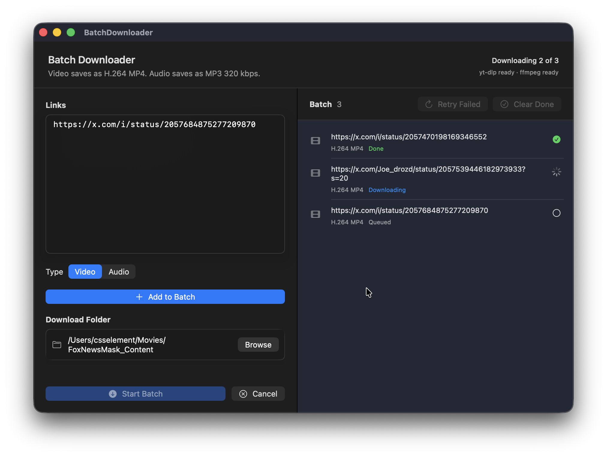

# ClipBatch

ClipBatch is a minimal native macOS app for batch downloading social media video and audio with `yt-dlp` and `ffmpeg`.



The app is designed for a simple workflow:

1. Paste one or more links, one per line.
2. Or use File > Open Text File... to load a prepared `.txt` list.
3. Choose whether those links should be downloaded as video or audio.
4. Pick a download folder with Browse.
5. Start the batch.

## What It Is For

This MVP is for quickly downloading media from popular websites supported by `yt-dlp`, especially when collecting multiple links before starting a batch. It prioritizes compatibility and usability over advanced download controls.

## Hardcoded Formats

The download settings are intentionally hardcoded:

- Video downloads prefer original H.264 MP4 when available.
- If the final video is not H.264, the app transcodes it to H.264 MP4 with `ffmpeg`.
- Audio downloads are always extracted as MP3 at 320 kbps.

There are no user-facing codec, container, bitrate, or quality settings. This keeps the app straightforward and produces files that are broadly compatible with media players, editors, and sharing workflows.

## Rate-Limit Safeguards

The app downloads batch items sequentially and adds cooldown time between downloads to reduce the chance of platform throttling. It also passes conservative sleep and retry settings to `yt-dlp`.

When a batch contains many queued links, the app shows a rate-limit warning. The cooldown status counts down live between downloads. Rate-limiting can be disabled for short batches, but it is forced on for larger queues.

If YouTube or another site returns a bot-check, login challenge, or rate-limit error, the app stops the batch automatically and shows a modal with remediation steps. These safeguards reduce risk, but they cannot guarantee that YouTube or another platform will not throttle, block, or challenge automated download traffic.

## Batch Controls

- Add links manually or import one-link-per-line `.txt` files from the File menu.
- The link editor moves to a new line after pasted links to speed up list entry.
- Active downloads show progress percentage and a compact title/thumbnail when that metadata is available from the current download.
- Stop Batch cancels the active download and prevents the queue from advancing to the next item.
- File > Stop Batch also cancels an active batch.

## Requirements

- macOS 14 or newer
- Swift toolchain for building from source
- `yt-dlp` installed at `/opt/homebrew/bin/yt-dlp`
- `ffmpeg` installed at `/opt/homebrew/bin/ffmpeg`

The current build assumes Homebrew-style Apple Silicon paths for `yt-dlp` and `ffmpeg`.

If you do not already have them, install [Homebrew](https://brew.sh/) first, then run:

```bash
brew install yt-dlp ffmpeg
```

## Build And Run

Use the project script:

```bash
./script/build_and_run.sh
```

To build, launch, and verify the running process:

```bash
./script/build_and_run.sh --verify
```

The script stages a native app bundle at:

```text
dist/BatchClip.app
```

## Downloadable Builds

Prebuilt binaries are published on the GitHub Releases page when available:

```text
https://github.com/csselement/clipbatch/releases
```

The release asset is a zipped macOS app. Unzip it, move `BatchClip.app` to Applications if desired, and launch it.

Current binaries are ad-hoc signed but not Apple Developer ID notarized. macOS may show a Gatekeeper warning the first time the app is opened.

To create a release zip locally:

```bash
./script/package_release.sh 0.1.0
```

## Limitations

- Download behavior depends on `yt-dlp` support for each website.
- Large batches may still trigger platform rate limits, throttling, login prompts, or temporary blocks.
- Some sites may require cookies, login, or additional `yt-dlp` options that this MVP does not expose.
- The app does not provide per-link quality controls.
- The app shows a running progress indicator and percentage for the active download.
- Dependency paths are hardcoded to `/opt/homebrew/bin`.
- Playlist downloading is disabled; the app expects direct media links.
